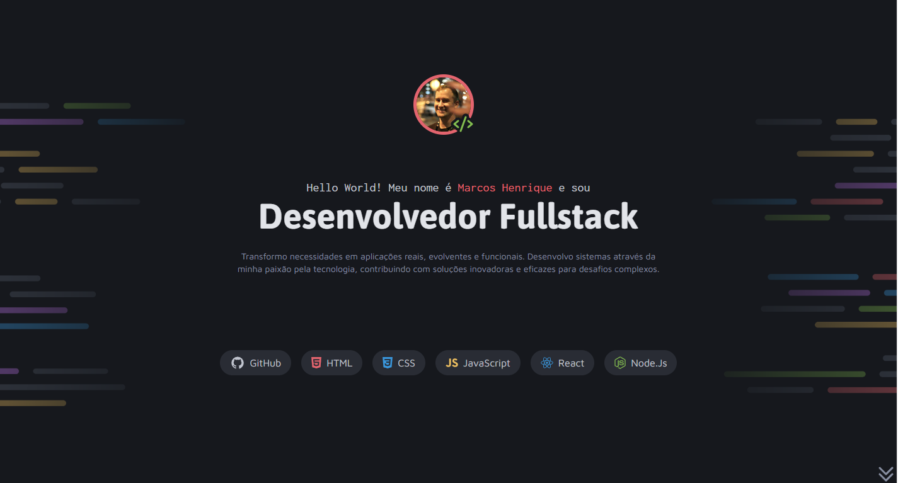

<h1 align="center"> Portfólio Dev </h1>

Portfólio de um dev fictício feito como forma de estudos do curso Fullstack da Rocketseat

<a href="#-tecnologias">Tecnologias</a>&nbsp;&nbsp;&nbsp; |&nbsp;&nbsp;&nbsp;&nbsp;
<a href="#-projeto">Projeto</a>&nbsp;&nbsp;&nbsp;|&nbsp;&nbsp;&nbsp;
<a href="#-layout">Layout</a>&nbsp;&nbsp;&nbsp;|&nbsp;&nbsp;&nbsp;
<a href="#-learning">Aprendizados</a>

## 🚀 Tecnologias

Esse projeto foi desenvolvido com as seguintes tecnologias:

- HTML e CSS
- JavaScript
- Git e Github
- FIGMA

## 💻 Projeto

O Portfólio Dev é um portfólio de um dev fictício, onde listei todas as tecnologias que ele aprendeu e também os projetos onde trabalhou, deixei todos os links com um "#" para não direcionar, já que é um dev fictício, porém atráves dele pude ampliar alguns conhecimentos.

## 📚Aprendizados

Este projeto foi um desafio feito dentro do curso de Fullstack no módulo "avançando no CSS" da Rocketseat, nele pude ampliar conhecimentos de animações do CSS, como era um desafio busquei ampliar um pouco mais o que aprendi e utilizei do Javascript apenas para sistemas de scroll da pagina. E utilizei também das animações para dar uma fluidez ainda maior no scroll da página.